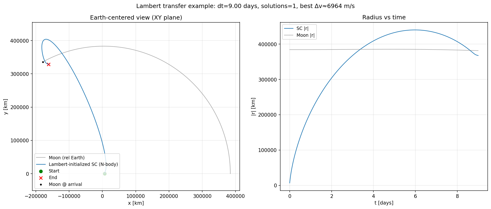
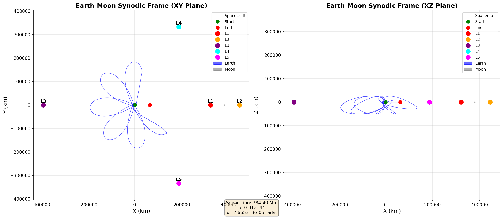

# orbitsim (header-only library)

Small header-only orbit simulation library intended for games:

- 2-body Kepler propagator (universal variables) for quick/debug orbits
- Restricted full N-body simulation:
  - Massive bodies (planets/moons): symplectic 4th order (Yoshida composition)
  - Massless spacecraft: DOPRI5(4) with interpolation of massive body states
- Fixed-step and adaptive trajectory helpers for orbit-line rendering
- Segment-aware frame transforms for inertial/body-fixed/synodic/LVLH display paths

Assumptions / conventions:

- Units: SI (`m`, `s`, `kg`)
- Frame: inertial barycentric
- Angles: radians
- Rotation: fixed spin axis + constant spin rate (no torques)

## Usage
See [docs/usage.md](docs/USAGE.md).

### Adaptive Prediction

`orbitsim` now exposes adaptive, error-budgeted prediction entry points:

- `build_celestial_ephemeris_adaptive(...)`
- `predict_spacecraft_trajectory_segments_adaptive(...)`
- `transform_trajectory_segments_to_frame_spec(...)`

These APIs keep `TrajectorySegment` as the canonical prediction output and relegate samples to a display/resampling layer.

## Gallery

